# Arkitektur – langrenn-sprint

## Introduksjon

**langrenn-sprint** er en samlet applikasjon for administrasjon og visning av sprint-skirenn. Applikasjonen består av to frontend-tjenester – **event-service-gui** og **result-service-gui** – som hver kommuniserer med et sett av backend-mikrotjenester og en felles MongoDB-database.

- **event-service-gui** brukes til oppsett av arrangement: opprette arrangement, importere deltakere, sette opp klasser, startlister og kjøreplan.
- **result-service-gui** brukes under selve rennet: live tidtaking, resultater, startliste-redigering og fotofinish.

Deployment av alle tjenestene er samlet i repository [langrenn-sprint/deploy](https://github.com/langrenn-sprint/deploy).

---

## C4 – Kontekstnivå (overordnet)

Diagrammet nedenfor viser langrenn-sprint som ett system, brukerne som interagerer med det, og de viktigste avhengighetene.

```mermaid
graph TB
    subgraph Brukere["👤 Brukere"]
        Admin["Arrangør / Administrator\nSetter opp arrangement,\nadministrerer under rennet"]
        Tidtaker["Tidtaker\nRegistrerer målpasseringer"]
        Tilskuer["Tilskuer / Deltaker\nSer resultater og lister"]
    end

    subgraph System["🏔️ langrenn-sprint"]
        direction TB
        EventGUI["📋 event-service-gui\nOppsett av arrangement\n(klasser, deltakere, startlister)"]
        ResultGUI["🏁 result-service-gui\nLive tidtaking og resultater\n(kontroll, timing, fotofinish)"]
    end

    subgraph Mikrotjenester["🔧 Mikrotjenester"]
        EventSvc["Event Service\nArrangement og løpsdata"]
        UserSvc["User Service\nAutentisering"]
        RaceSvc["Race Service\nTidtaking og resultater"]
        FormatSvc["Competition Format Service\nKlasser og regelverk"]
        PhotoSvc["Photo Service\nFotofinish og bilder"]
    end

    subgraph Data["💾 Database"]
        MongoDB["MongoDB\nFelles datakilde"]
    end

    Admin -->|"nettleser"| EventGUI
    Admin -->|"nettleser"| ResultGUI
    Tidtaker -->|"nettleser"| ResultGUI
    Tilskuer -->|"nettleser"| ResultGUI

    EventGUI -->|"REST API"| EventSvc
    EventGUI -->|"REST API"| UserSvc
    EventGUI -->|"REST API"| FormatSvc

    ResultGUI -->|"REST API"| EventSvc
    ResultGUI -->|"REST API"| UserSvc
    ResultGUI -->|"REST API"| RaceSvc
    ResultGUI -->|"REST API"| FormatSvc
    ResultGUI -->|"REST API"| PhotoSvc

    EventSvc -->|"lese/skrive"| MongoDB
    UserSvc -->|"lese/skrive"| MongoDB
    RaceSvc -->|"lese/skrive"| MongoDB
    FormatSvc -->|"lese/skrive"| MongoDB
    PhotoSvc -->|"lese/skrive"| MongoDB

    classDef user fill:#50C878,stroke:#2D7A4A,stroke-width:2px,color:#fff
    classDef gui fill:#4A90E2,stroke:#2E5C8A,stroke-width:3px,color:#fff
    classDef service fill:#FF9500,stroke:#994D00,stroke-width:2px,color:#fff
    classDef database fill:#EE5A6F,stroke:#8A2335,stroke-width:2px,color:#fff

    class Admin,Tidtaker,Tilskuer user
    class EventGUI,ResultGUI gui
    class EventSvc,UserSvc,RaceSvc,FormatSvc,PhotoSvc service
    class MongoDB database
```

---

## Komponentbeskrivelse

### event-service-gui
Nettbasert grensesnitt for oppsett av arrangement. Brukes **før** og mellom heat for å:
- Opprette og konfigurere arrangement
- Importere og administrere deltakere
- Definere klasser og kjøreplan

👉 Se detaljert arkitekturdokumentasjon i [event-service-gui/docs](https://github.com/langrenn-sprint/event-service-gui/blob/main/docs/01_architecture_overview.md)

### result-service-gui
Nettbasert grensesnitt for gjennomføring av rennet. Brukes **under** rennet for å:
- Vise og redigere startlister
- Registrere og korrigere tidtaking
- Vise live resultater
- Administrere fotofinish

👉 Se detaljert arkitekturdokumentasjon i [result-service-gui/docs](https://github.com/langrenn-sprint/result-service-gui/blob/main/docs/01_architecture_overview.md)

### Mikrotjenester
Alle GUI-er er stateless og delegerer datalagring og forretningslogikk til backend-mikrotjenester via REST API (JSON):

| Tjeneste | Ansvar |
|---|---|
| **Event Service** | Arrangement, klasser, deltakere, løpsplan |
| **User Service** | Autentisering (JWT) og brukerhåndtering |
| **Race Service** | Tidtaking, startlister og resultatberegning |
| **Competition Format Service** | Konkurranseformater og algoritmer |
| **Photo Service** | Fotofinish og bildearkiv |

### Deployment
Alle tjenester kjøres som Docker-containere og startes opp via Docker Compose.
Konfigurasjon og oppstartsscript er samlet i [langrenn-sprint/deploy](https://github.com/langrenn-sprint/deploy).

---

## Teknologioversikt

| Komponent | Teknologi |
|---|---|
| Frontend-rammeverk | aiohttp + Jinja2 (Python) |
| Autentisering | JWT (Bearer tokens) |
| Kommunikasjon | REST API over HTTP/HTTPS |
| Database | MongoDB |
| Containerisering | Docker / Docker Compose |
| Reverse proxy / TLS | Nginx + Certbot |
